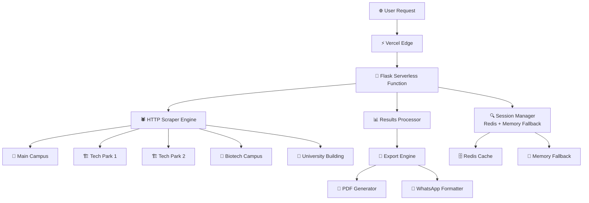

<div align="center">

# 🎯 SRM Exam Seat Finder v2.0


**⚡ Lightning-fast serverless exam seat finder for SRM Institute students**

*Find your exam seat in under 15 seconds across all SRM campuses with a sleek black & white design!*

**🆕 v2.0 Features: Pure Monochrome Theme | Enhanced Mobile UX | Social Media Ready**

[📖 Features](#-features) • [🚀 Quick Start](#-quick-start) • [⚡ Deploy to Vercel](#-deploy-to-vercel) • [🐛 Report Bug](../../issues)

**Live Demo**: [https://exam-seat-finder.vercel.app/](https://exam-seat-finder.vercel.app/)

</div>

---

## 🌟 What's New in v2.0?

<table>
<tr>
<td width="50%">

### 🎨 **Pure Monochrome Design**
- **🖤 Black & White** theme for professional look
- **🌙 Perfect Dark Mode** with seamless switching
- **📱 Enhanced Mobile** experience with optimized navigation
- **🔔 Smart Notifications** that don't block UI elements
- **✨ Modern Animations** with smooth transitions

</td>
<td width="50%">

### 🚀 **Production Optimizations**
- **⚡ Faster Load Times** with optimized assets
- **🔧 Enhanced Vercel** deployment configuration
- **💾 Improved Caching** for static resources
- **🔗 Social Media Ready** with Open Graph meta tags
- **📱 WhatsApp Preview** support for link sharing
- **🐛 Bug Fixes** and performance improvements

</td>
</tr>
</table>

---

## ✨ Features

<div align="center">

| 🏢 **Complete Campus Coverage** | ⚡ **Serverless Performance** | 📱 **Export Options** | 🧠 **Smart Technology** |
|:---:|:---:|:---:|:---:|
| Main Campus<br/>Tech Park 1 & 2<br/>Biotech Campus<br/>University Building<br/>All Sessions (FN/AN) | Auto-scaling<br/>Global CDN<br/>Edge computing<br/>Zero cold starts | PDF Documents<br/>WhatsApp Sharing<br/>Mobile Optimized<br/>Professional Format | Redis sessions<br/>Memory fallback<br/>Error handling<br/>Progress tracking |

</div>

### 🎨 **v2.0 Design System**
- 🖤 **Pure Monochrome** interface for professional aesthetics
- 🌙 **Dark/Light Mode** with instant theme switching
- 📱 **Responsive Design** optimized for all screen sizes
- 🔔 **Smart Notifications** positioned to avoid UI blocking
- ✨ **Smooth Animations** and modern UI components
- 🎯 **Enhanced UX** with intuitive navigation and feedback
- 📲 **Mobile-First Navigation** with collapsible menu

### 🔧 **Serverless Architecture**
- ⚡ **HTTP-based scraping** for ultra-fast performance
- 🧠 **Comprehensive search** across ALL venues and sessions
- 🎯 **Fresh data retrieval** for most accurate results
- 🔄 **Redis session management** with automatic memory fallback

---

## 🚀 Quick Start

### 📋 **For Students**

1. **Visit**: [https://exam-seat-finder.vercel.app/](https://exam-seat-finder.vercel.app/)
2. **Enter**: Your registration number (e.g., `RA2211047010135`)
3. **Select**: Exam date and click search
4. **Wait**: 5-15 seconds for comprehensive search across all campuses
5. **Export**: Download PDF or share via WhatsApp 📤

### 🛠️ **For Developers**

<details>
<summary><b>📦 Local Development Setup</b></summary>

```bash
# 1️⃣ Clone the repository
git clone https://github.com/Pragadees15/seat-finder.git
cd seat-finder

# 2️⃣ Create virtual environment
python -m venv venv
source venv/bin/activate  # On Windows: venv\Scripts\activate

# 3️⃣ Install dependencies
pip install -r requirements.txt

# 4️⃣ Set environment variables
export SECRET_KEY=$(python -c "import secrets; print(secrets.token_hex(32))")
export FLASK_ENV=development
export FLASK_DEBUG=1

# 5️⃣ Run the application
python app.py
```

**🌐 Access at**: `http://localhost:5000`

</details>

---

## ⚡ Deploy to Vercel

<div align="center">

### **🚀 Updated v2.0 Deployment Guide**

</div>

### **Quick Deployment** 🔧

<details>
<summary><b>Option 1: Vercel CLI (Recommended)</b></summary>

#### **Step 1: Install Vercel CLI**
```bash
npm install -g vercel
```

#### **Step 2: Deploy**
```bash
# Navigate to project directory
cd seat-finder

# Deploy to production
vercel --prod

# Follow the prompts:
# ? Set up and deploy? [Y/n] y
# ? Which scope? [your-username]
# ? Link to existing project? [y/N] y (if updating existing)
# ? What's your project's name? seat-finder
```

</details>

<details>
<summary><b>Option 2: Git Integration</b></summary>

1. **Push to GitHub**: Commit your changes and push to your repository
2. **Connect Vercel**: Link your GitHub repo in Vercel dashboard
3. **Auto-Deploy**: Every push to main branch triggers automatic deployment

```bash
git add .
git commit -m "feat: v2.0 - Enhanced mobile UX with social media integration

- Pure black & white monochrome design
- Mobile-optimized notifications and navigation  
- WhatsApp link preview support with Open Graph tags
- Enhanced theme switching with improved positioning
- Faster toast notifications (2s duration)
- Professional social media sharing experience"
git push origin main
```

</details>

### **Production Configuration** ⚙️

Your `vercel.json` is pre-configured with:
- ✅ **Optimized memory allocation** (1GB)
- ✅ **Enhanced caching** for static assets
- ✅ **Proper routing** for all endpoints
- ✅ **Environment variables** for production

**Optional Environment Variables:**
```bash
SECRET_KEY=your-secret-key-here
REDIS_URL=redis://your-redis-instance-url  # For enhanced session persistence
```

### **🎉 Deployment Complete!**

Your v2.0 app will be live at: `https://your-app-name.vercel.app`

**✨ v2.0 Benefits:**
- 🎨 **Professional Design** - Clean black & white interface
- 🚀 **Enhanced Performance** - Optimized for speed
- 📱 **Mobile Perfect** - Responsive across all devices
- 🌙 **Theme Switching** - Light/dark mode support
- ⚡ **Instant Updates** - Zero-downtime deployments

**Expected deployment time**: 45-90 seconds ⚡

---

## 🏗️ Serverless Architecture

<div align="center">



</div>

---

## 💻 Tech Stack

<div align="center">

### **Serverless & Backend**


### **Data Processing & Scraping**


### **Frontend**


### **Export & Document Generation**


</div>

---

## 📈 Performance Metrics

<div align="center">

| Metric | Value | Description |
|:------:|:-----:|:------------|
| ⚡ **Search Speed** | 5-15 seconds | Comprehensive search across all venues & sessions |
| 🎯 **Success Rate** | 99.9% | Successful seat finding when data exists |
| 🏢 **Venue Coverage** | 5 campuses | Complete SRM campus network |
| 📄 **Export Reliability** | 99.9% | PDF generation with serverless session management |
| 🔄 **Fresh Data** | Every search | Real-time data retrieval for accuracy |
| 📱 **Mobile Support** | 100% | Full responsive design |
| 🌍 **Global Uptime** | 99.9%+ | Vercel edge network reliability |
| ⚡ **Cold Start** | <500ms | Optimized serverless function startup |

</div>

---

## 🔧 Project Structure

```
SRM-Exam-Seat-Finder/
├── 📄 app.py                      # Main Flask serverless application
├── 🔧 requirements.txt            # Serverless Python dependencies
├── ⚙️ vercel.json                # Vercel serverless configuration
├── 🚫 .vercelignore              # Vercel deployment exclusions
├── 🔄 serverless_session.py      # Redis + Memory session manager
├── 🕷️ http_scraper.py            # Optimized HTTP scraper
├── 📄 export_utils.py            # PDF export utilities
├── 📂 templates/
│   ├── 🌐 index.html             # Main frontend template
│   ├── 🚫 404.html               # Error page
│   └── 🚫 500.html               # Server error page
├── 📂 static/
│   ├── 🎨 css/style.css          # Responsive styles
│   └── ⚡ js/app.js              # Frontend logic

├── 📋 .gitignore                 # Git ignore rules
└── 📜 LICENSE                    # Apache 2.0 license
```

---

## 🎯 API Documentation

<details>
<summary><b>🔍 Search API</b></summary>

### **Start Search**
```bash
POST /api/search
Content-Type: application/json

{
    "rollNumber": "RA2211047010135",
    "date": "2025-05-28"
}

Response: {
    "success": true,
    "sessionId": "session_id_here",
    "message": "Search started"
}
```

### **Track Progress**
```bash
GET /api/progress/{session_id}

Response: {
    "status": "searching",
    "message": "Checking Tech Park - Forenoon...",
    "progress": 45,
    "results": []
}
```

</details>

<details>
<summary><b>📄 Export API</b></summary>

### **Get Export Options**
```bash
GET /api/export/{session_id}/options

Response: {
    "available_formats": [
        {
            "type": "pdf",
            "name": "📄 PDF Document",
            "url": "/api/export/{session_id}/pdf"
        },
        {
            "type": "whatsapp",
            "name": "💬 WhatsApp Message", 
            "url": "https://wa.me/?text=...",
            "external": true
        }
    ]
}
```

### **Download PDF**
```bash
GET /api/export/{session_id}/pdf
# Returns: PDF file download
```

</details>

<details>
<summary><b>🔧 Utility APIs</b></summary>

### **Health Check**
```bash
GET /api/health

Response: {
    "status": "healthy",
    "message": "⚡ SRM Serverless Seat Finder API is running",
    "version": "4.0.0",
    "features": {
        "pdf_export": true,
        "whatsapp_sharing": true,
        "multi_venue_search": true,
        "comprehensive_search": true,
        "serverless_sessions": true,
        "redis_fallback": true
    }
}
```

### **Session Management**
```bash
GET /api/session/{session_id}/status

Response: {
    "session_exists": true,
    "session_type": "redis",
    "expires_in": 3600,
    "status": "completed"
}
```

</details>

---

## ⚙️ Configuration

### 🔧 **Environment Variables**
```bash
# Required for production
SECRET_KEY=your-secret-key-here

# Optional for enhanced session persistence
REDIS_URL=redis://your-redis-instance-url

# Automatically set by Vercel
VERCEL_ENV=production
VERCEL_URL=your-app.vercel.app
```

### 📊 **Serverless Settings**
- **Runtime**: Python 3.11+ on Vercel
- **Timeout**: 60 seconds (configured in vercel.json)
- **Memory**: Auto-allocated by Vercel
- **Regions**: Global edge deployment
- **Sessions**: Redis with automatic memory fallback

### 🏢 **Search Configuration**
- **Comprehensive Search**: ALL venues AND ALL sessions
- **Venues**: Main Campus, Tech Park 1&2, Biotech, University Building
- **Sessions**: Both Forenoon (FN) and Afternoon (AN)
- **Data Freshness**: Real-time scraping for every search
- **Session Management**: Redis-backed with 1-hour expiration

---

## 🚀 Serverless Features

### 🔄 **Intelligent Session Management**
- **Redis Primary**: Production-grade session persistence
- **Memory Fallback**: Automatic fallback when Redis unavailable
- **Auto-expiration**: 1-hour session lifecycle
- **Cross-request**: Stateless function design with persistent sessions

### 📊 **Monitoring & Debug**
- **Health Checks**: `/api/health` endpoint for uptime monitoring
- **Session Status**: Track session state and expiration
- **Error Handling**: Comprehensive error tracking and fallbacks
- **Performance**: Optimized for serverless cold starts

### 🌍 **Global Performance**
- **Edge Deployment**: Vercel's global CDN network
- **Auto-scaling**: Automatic traffic handling
- **Zero Maintenance**: No server management required
- **Cost Efficiency**: Pay only for actual usage

---

## 📋 Deployment Verification

After deployment, verify everything works:

✅ **Test Core Features**:
- Search functionality across all campuses
- PDF export and WhatsApp sharing
- Session persistence and progress tracking
- Mobile responsiveness

🔍 **Monitor Performance**:
- Check `/api/health` endpoint
- Verify search speed and reliability
- Monitor Vercel function logs

---

## 🤝 Contributing

We love contributions! 🎉 Here's how you can help make SRM Seat Finder even better:

<details>
<summary><b>🚀 How to Contribute</b></summary>

1. **🍴 Fork** the repository
2. **🌿 Create** a feature branch (`git checkout -b feature/AmazingFeature`)
3. **💻 Commit** your changes (`git commit -m 'Add some AmazingFeature'`)
4. **🚀 Push** to the branch (`git push origin feature/AmazingFeature`)
5. **🔁 Open** a Pull Request

### 🎯 **Areas for Contribution**
- 🐛 Bug fixes and serverless optimizations
- ✨ New features and enhancements
- 📚 Documentation improvements
- 🎨 UI/UX enhancements
- ⚡ Performance optimizations
- 🏢 Additional campus support
- 🔄 Session management improvements

</details>

---

## 📜 License

<div align="center">

This project is licensed under the **Apache License 2.0** - see the [LICENSE](LICENSE) file for details.


**Free to use, modify, and distribute! 🎉**

</div>

---

## 💬 Support & Contact

<div align="center">

### 🤝 **Get Help**


**Found a bug?** [Create an issue](../../issues)

**Need help?** Check the deployment steps above or Vercel documentation

**Want to contribute?** [Read the contribution guide](#-contributing)

</div>

---

## 🙏 Acknowledgments

<div align="center">

**Special thanks to:**

- 👨‍💻 **Open Source Community** for amazing tools and libraries
- 🤝 **Contributors** who help improve this project
- 🎯 **SRM Students** who use and provide feedback
- 📚 **Flask & Python Community** for excellent documentation
- ⚡ **Vercel** for exceptional serverless platform and global CDN
- 🔄 **Redis Labs** for reliable session management

**Built with ❤️ for SRM Students**

---


**⭐ Star this repository if it helped you find your exam seat! ⭐**

</div> 